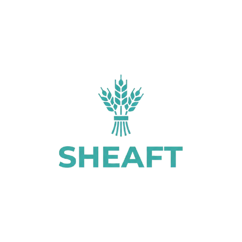

# Sheaft



## Name meaning

**Sheaft** (pronounced **/ʃiːft/**) is a composite name: **sheaf** ~~theory~~ **+** ~~shif~~**t**.

- **sheaf-**: the long-term analysis direction includes sheaf theory.
- **-t**: the product drives a shift-left posture for earlier incident risk detection and mitigation.

Current status: sheaf-based capabilities are not implemented yet in this MVP.  
Roadmap: https://mb3r-lab.github.io/

## Research basis

1. [**Model Discovery and Graph Simulation: A Lightweight Gateway to Chaos Engineering**](https://www.alphaxiv.org/abs/2506.11176)  
   The 48th IEEE/ACM International Conference on Software Engineering - New Ideas and Emerging Results (ICSE-NIER 2026)
2. [**Evaluating Asynchronous Semantics in Trace-Discovered Resilience Models: A Case Study on the OpenTelemetry Demo**](https://www.alphaxiv.org/abs/2512.12314)  
   The 40th International Conference on Advanced Information Networking and Applications (AINA-2026)

Sheaft is a pre-release resilience gate for microservice systems.  
It consumes a model produced by [**Bering**](https://github.com/MB3R-Lab/Bering), runs graph-based availability simulation, and emits a release decision (`pass`/`warn`/`fail`) plus machine-readable artifacts.

## What it is

Sheaft provides a model-consumer workflow:

1. `simulate`: Bering model + policy -> endpoint availability estimates.
2. `gate`: compare estimates against policy thresholds.
3. `run`: one-shot CI pipeline (`model -> report -> decision`).

`discover` exists only as an experimental local helper and is not the production discovery path.

## Bering integration

Sheaft is a downstream client of [Bering](https://github.com/MB3R-Lab/Bering).

1. **Bering** performs discovery and emits `bering-model.json`.
2. CI/CD fetches that artifact into the workspace (for example: `artifacts/bering-model.json`).
3. **Sheaft** runs simulation and gate decision on top of that model.

Example:

```bash
sheaft run --model artifacts/bering-model.json --policy configs/gate.policy.example.yaml --out-dir out --seed 42
```

If model schema metadata does not match the pinned contract, Sheaft fails fast before simulation.

## Why this exists

Live chaos campaigns are valuable but expensive and operationally constrained when used broadly and continuously.  
Sheaft focuses on making resilience checks:

- cheap (uses Bering model artifacts + policy),
- safe (no direct production fault injection),
- regular (CI-friendly, repeatable in minutes).

## How it works

`Bering discovery -> model artifact -> Sheaft simulate -> Sheaft gate`

- **Bering**: discovers topology and produces canonical model artifact.
- **Model contract**: strict schema metadata binding (`name/version/uri/digest` exact match).
- **Simulate**: run fail-stop Monte Carlo over blocking synchronous dependencies.
- **Gate**: evaluate availability thresholds and emit decision.

## Contract ownership and strict version pinning

- Canonical schema is owned by [**Bering**](https://github.com/MB3R-Lab/Bering).
- Sheaft enforces exact-match schema metadata in model file:
  - `metadata.schema.name = io.mb3r.bering.model`
  - `metadata.schema.version = 1.0.0`
  - `metadata.schema.uri = https://schemas.mb3r.dev/bering/model/v1.0.0/model.schema.json`
  - `metadata.schema.digest = sha256:7dc733936a9d3f94ab92f46a30d4c8d0f5c05d60670c4247786c59a3fe7630f7`
- Any mismatch fails fast before simulation.

## Repository layout

```text
cmd/sheaft                 CLI entrypoint
internal/app               command orchestration
internal/discovery/otel    experimental local discovery helper
internal/model             domain model + validation + IO
internal/modelcontract     strict Bering schema pinning (name/version/uri/digest)
internal/simulation        Monte Carlo availability engine
internal/gate              policy evaluation
internal/report            JSON/markdown reporting
internal/config            policy/config parsing
api/schema                 model/policy/report JSON schemas
configs                    example runtime + policy configs
examples                   sample traces + sample outputs
docs                       architecture/methodology/limits/roadmap
scripts/ci                 CI helper script
test                       fixtures + integration/e2e tests
```

## Quickstart (Docker-first)

### 1) Build image

```bash
docker build -f build/Dockerfile -t sheaft:dev .
```

### 2) Run end-to-end pipeline

```bash
docker run --rm -v "$PWD:/workspace" -w /workspace sheaft:dev run \
  --model examples/outputs/model.sample.json \
  --policy configs/gate.policy.example.yaml \
  --out-dir examples/outputs/generated \
  --seed 42
```

### 3) Inspect artifacts

```bash
cat examples/outputs/generated/report.json
cat examples/outputs/generated/summary.md
```

## CLI

```bash
sheaft discover --input <trace-file|dir> --out <model.json>   # experimental only
sheaft simulate --model <model.json> --policy <policy.yaml> --out <report.json> --seed <int>
sheaft gate --report <report.json> --policy <policy.yaml> --mode warn|fail|report
sheaft run --model <model.json> --policy <policy.yaml> --out-dir <dir> --seed <int>
```

Exit codes:

- `0`: success / pass / warn / report
- `2`: policy fail (when mode is `fail`)
- `1`: runtime/config/input error

## CI integration

See [docs/ci-gate.md](docs/ci-gate.md) for a full workflow snippet.

Minimal GitHub Actions step:

```yaml
- name: Run Sheaft gate
  run: |
    docker run --rm -v "$PWD:/workspace" -w /workspace sheaft:dev run \
      --model artifacts/bering-model.json \
      --policy configs/gate.policy.example.yaml \
      --out-dir out \
      --seed 42
```

## Outputs

- Model schema: `api/schema/model.schema.json`
- Policy schema: `api/schema/policy.schema.json`
- Report schema: `api/schema/report.schema.json`
- Sample model: `examples/outputs/model.sample.json`
- Sample report: `examples/outputs/report.sample.json`

## Limitations

Current MVP limitations are explicit:

- connectivity-first approximation (graph + replicas);
- no correlated or gray-failure modeling in v0;
- async edge treatment has limited effect for immediate HTTP SLO in the studied benchmark case.
- Sheaft does not own model discovery in production flow; [Bering](https://github.com/MB3R-Lab/Bering) is required upstream.

See [docs/assumptions-and-limitations.md](docs/assumptions-and-limitations.md).

## Roadmap

- Epic index: https://github.com/MB3R-Lab/Sheaft/issues/71
- R1-R10 epics: [docs/roadmap.md](docs/roadmap.md)

## License

MIT, see [LICENSE](LICENSE).
